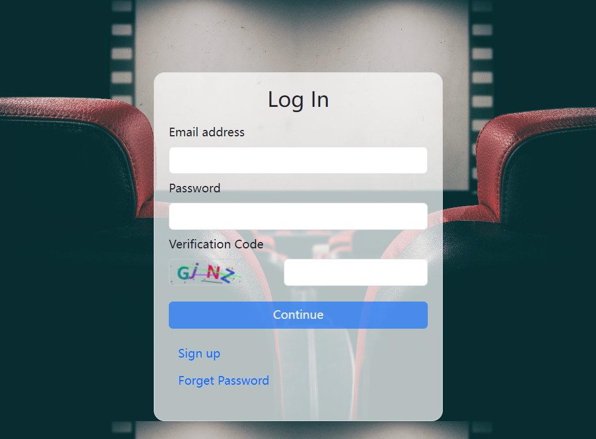
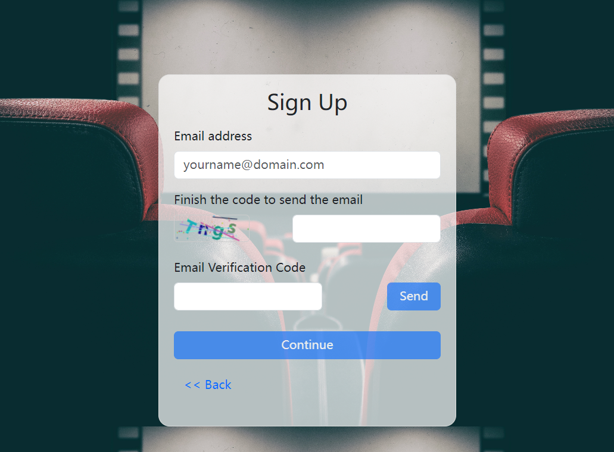

# INFO6150-Project-Yuheng Li




## used bootstrap class
###### card, container, model and toast
modal, modal-dialog, modal-content, modal-header, modal-title, modal-body, modal-footer, toast-container, toast, toast-body, container, card, card-body
###### form
form-label,  form-control
###### button
btn-close,  btn, btn-secondary, btn-close, btn-close-white, btn-link sign-link-button
###### navs and tabs
fade
###### word
page-title
###### position, color, style
position-fixed, top-0, start-50, translate-middle-x, p-3, d-flex, align-items-center, text-white, bg-danger, border-0, me-2 m-auto, mb-3, row, col-sm-3, col-sm-7 offset-sm-2, col-lg-12


## Structure

│  log-in.html<br>
│  log-in.js<br>
│  readme.md<br>
|  reset-password.html<br>
|  reset-password.js<br>
│  sign-up.html<br>
│  sign-up.js<br>
│  sign.css<br>
├─bootstrap-5.3.3-dist<br>
└─resource<br>
    └─imgage


## Installation
the back end  is not implemented yet
please use a mock back end

intall json server
``` cmd
npm install -g json-server
```

create db.json with following json
``` json
{  
  "users": [  
    {  
      "id": "28f9",  
      "email": "example email 1",  
      "password": "example password 1"  
    },  
    {  
      "id": "28f8",  
      "email": "example email 2",  
      "password": "example password 2" 
    }
  ]  
}
```

run josn server
```
json-server db.json --watch --port 5000
```

if the port is occupied, change the number 5000 and "fetch" in code
then you can log in and sign up
## Upload
Please follow the style.
Put your css and js code in separate files.<br>
<font color=red>Please use "**let and const**" to declare variables</font><br>
<font color=red>Please use "**let and const**" to declare variables</font>. Using "var" may result in scope conflicts.<br>
<font color=red>Please use "**\=\=\=**" to compare two value</font><br>


I download bootstrap and import it in the head domain
```
    <link rel="stylesheet" href="bootstrap-5.3.3-dist/css/bootstrap.css">
    <script src="bootstrap-5.3.3-dist/js/bootstrap.js"></script>
```
you can use the min one when finish progamming.
### Use the following code to generate verification code
you need to call refreshCode() to get a new code
``` javascript
let show_num = [];

function refreshCode(){
    draw(show_num);   
}// generate verification code

function draw(show_num) {
    let canvas_width = document.getElementById('canvas').clientWidth;
    let canvas_height = document.getElementById('canvas').clientHeight;
    let canvas = document.getElementById("canvas");//get the canvas object, the actor
    let context = canvas.getContext("2d");//get the environment of canvas drawing and the stage of actors performing
    canvas.width = canvas_width;
    canvas.height = canvas_height;
    let aCode = sCode.split(",");
    let aLength = aCode.length;
        
    for (let i = 0; i <= 3; i++) {
        let j = Math.floor(Math.random() * aLength);//produces a random radian between 0 and aLength
        let deg = Math.random() * 30 * Math.PI / 180;//produces a random radian between 0 and 30
        let txt = aCode[j];//get a random piece of content
        show_num[i] = txt;
        let x = 10 + i * 20;//The x coordinate of the text on the canvas
        let y = 20 + Math.random() * 8;//The y coordinate of the text on the canvas
        context.font = "bold 23px 微软雅黑";

        context.translate(x, y);
        context.rotate(deg);

        context.fillStyle = randomColor();
        context.fillText(txt, 0, 0);

        context.rotate(-deg);
        context.translate(-x, -y);
    }
    for (let i = 0; i <= 5; i++) { //generate lines on verification code
        context.strokeStyle = randomColor();
        context.beginPath();
        context.moveTo(Math.random() * canvas_width, Math.random() * canvas_height);
        context.lineTo(Math.random() * canvas_width, Math.random() * canvas_height);
        context.stroke();
    }
    for (let i = 0; i <= 30; i++) { //generate dots on verification code
        context.strokeStyle = randomColor();
        context.beginPath();
        let x = Math.random() * canvas_width;
        let y = Math.random() * canvas_height;
        context.moveTo(x, y);
        context.lineTo(x + 1, y + 1);
        context.stroke();
    }
}

function randomColor() {// get random color
    let r = Math.floor(Math.random() * 256);
    let g = Math.floor(Math.random() * 256);
    let b = Math.floor(Math.random() * 256);
    return "rgb(" + r + "," + g + "," + b + ")";
}
```

### About email

please import emiljs in the <font color=red>head</font> domain

``` javascript
<script type="text/javascript"
      src="https://cdn.jsdelivr.net/npm/@emailjs/browser@4/dist/email.min.js">
    </script>
    <script type="text/javascript">
      (function(){
        emailjs.init({
          publicKey: "efeIpbvvbrvnvcVBj",
        });
      })();
    </script>
```

use this to send a code

``` javascript
emailjs.init("efeIpbvvbrvnvcVBj");
    emailjs.send("service_12iga5f", "template_dza1quk", {
    to_name: //people who you want to send to,
    from_name: "INFO6150 Project Team",
	message: //your message,
    to_email: // email who you want to send to,
    })
```

And one **important** thing is <font color=red>**I have 200 sends a month**</font>, please do not use this function frequently. If you do not need this function, do not use it.